# Examples

Here we present a few examples to show how to work with the code and the related performances. All
cases have been run on a simple laptop

## Non-rotating, unmagnetised NS in STT with the APR EoS

This is a model of an unmagnetised NS in STTs with $\alpha _0 = -2.0\times 10^{-4}$ and $\beta _0 = -6$ described by the APR EoS. It has a J-frame central density $\rho _\mathrm{c}=1.4\times 10^{-3}$ in code units (corresponding to $8.684\times 10^{14}$ gcm$^{-3}$) and a Komar mass in the E-frame of $1.304$ M$ _\odot$. The circumferential radius in the J-frame is $14.100$ km, and the E-frame scalar charge is $0.665$ M$ _\odot$.

Here are the main parameters used to compute this model. The detailed log with all the parameters can be found in the corresponding LogFile.dat.

```
NR = 900, NTH = 100, NRREG = 600, MLS = 20, NGQ = 50, RREG = 10, RMAXSTR = 100,
RMAX = 100, REQMAX = 11.50, RHOINI = 1.40E-3, ALPHA0 = -2.0E-4, BETA0 = -6, GR = .FALSE.,
STRETCH = .TRUE., ANALYTIC = .TRUE., CONVHELP = .FALSE., QFACTOR = 0.85, QFACTORCHI = 0.45,
QFACTORMETRIC = 0.35, QRELAX = 0.30, QAPHI = 0.50
```

| 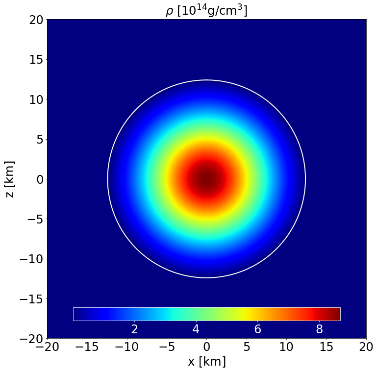 |
|:--:|
| *Section of the NS in the $x-z$ plane along with the contours the density.* |

| 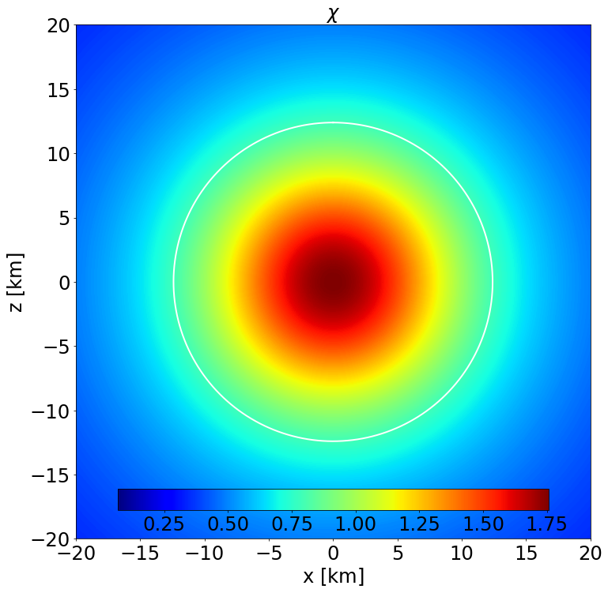 |
|:--:|
| *Section of the NS in the $x-z$ plane along with the contours the scalar field.* |

| 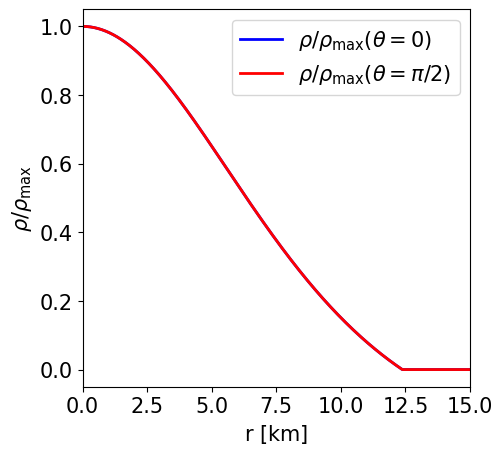 |
|:--:|
| *Radial profile of the NS density at the pole and at the equator.* |

| 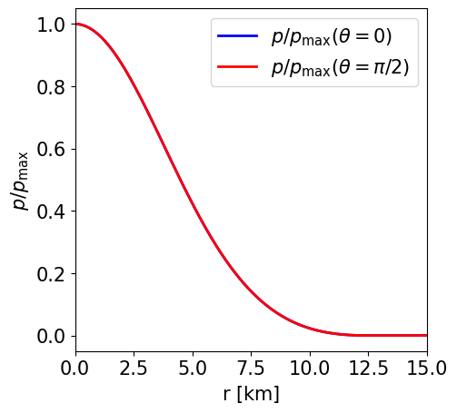 |
|:--:|
| *Radial profile of the NS pressure at the pole and at the equator.* |

| 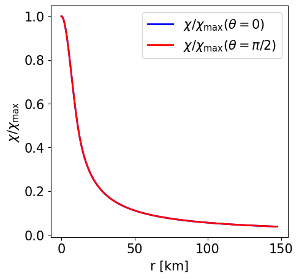 |
|:--:|
| *Radial profile of the scalar field at the pole and at the equator.* |

| 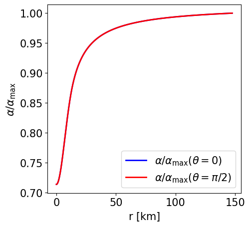 |
|:--:|
| *Radial profile of the lapse function at the pole and at the equator.* |

| 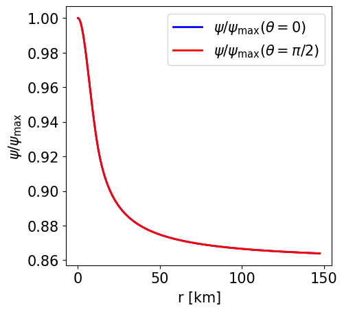 |
|:--:|
| *Radial profile of the conformal factor at the pole and at the equator.* |

## Non-rotating NS in STT with the APR EoS and a purely poloidal magnetic field

This is a model of an NS in STTs with $\alpha _0 = -2.0\times 10^{-4}$ and $\beta _0 = -6$ described by the APR EoS, endowed with a purely poloidal field. It has a J-frame central density $\rho _\mathrm{c}=1.4\times 10^{-3}$ in code units (corresponding to $8.684\times 10^{14}$ gcm$^{-3}$) and a Komar mass in the E-frame of $1.316$ M$ _\odot$. The circumferential radius in the J-frame is $14.234$ km, and the E-frame scalar charge is $0.688$ M$ _\odot$.

Here are the main parameters used to compute this model. The detailed log with all the parameters can be found in the corresponding LogFile.dat.

```
NR = 900, NTH = 100, NRREG = 600, MLS = 20, NGQ = 50, RREG = 10, RMAXSTR = 100,
RMAX = 100, REQMAX = 11.50, RHOINI = 1.40E-3, ALPHA0 = -2.0E-4, BETA0 = -6, GR = .FALSE.,
STRETCH = .TRUE., ANALYTIC = .TRUE., CONVHELP = .FALSE., QFACTOR = 0.85, QFACTORCHI = 0.45,
QFACTORMETRIC = 0.35, QRELAX = 0.30, QAPHI = 0.50, IMAG = .TRUE., IPOL = .TRUE., KBPOL = 0.2,
NPOL = 0.0, CSI = 0.0
```

| 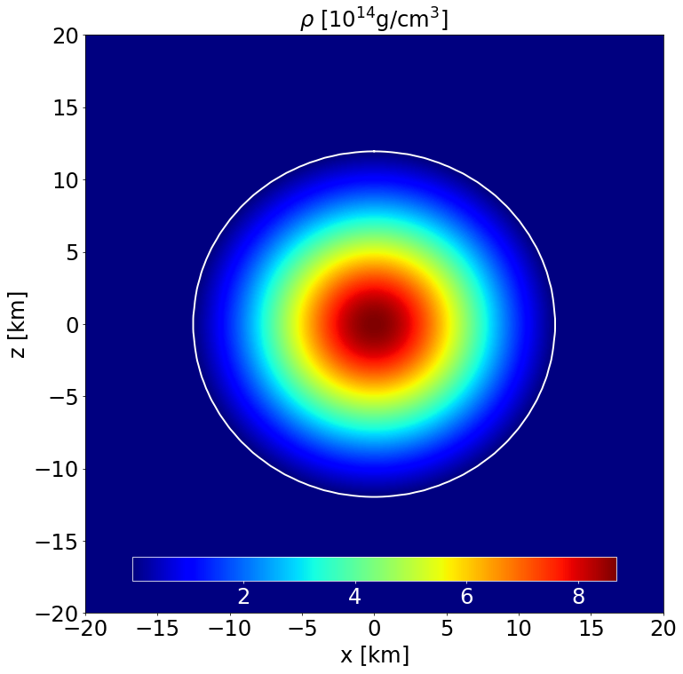 |
|:--:|
| *Section of the NS in the $x-z$ plane along with the contours the density.* |

|  |
|:--:|
| *Section of the NS in the $x-z$ plane along with the contours the scalar field.* |

| 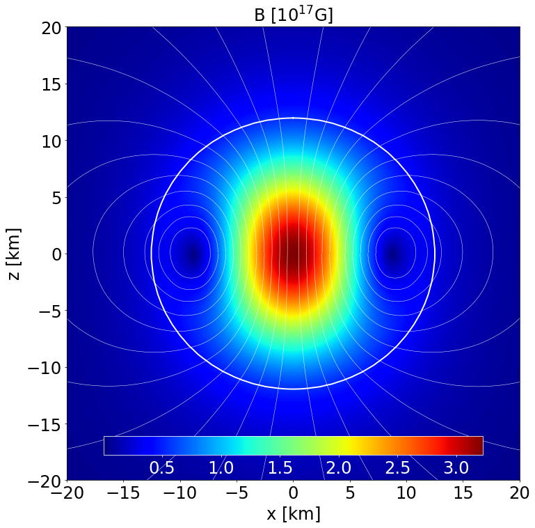 |
|:--:|
| *Section of the NS in the $x-z$ plane along with the contours the poloidal magnetic field strength and its field lines.* |

| 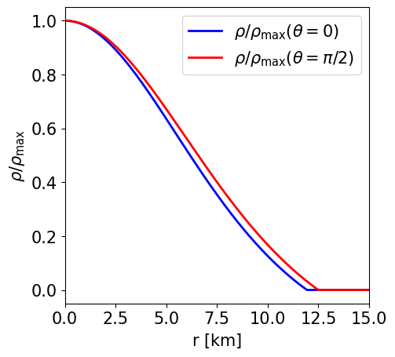 |
|:--:|
| *Radial profile of the NS density at the pole and at the equator.* |

|  |
|:--:|
| *Radial profile of the NS pressure at the pole and at the equator.* |

| 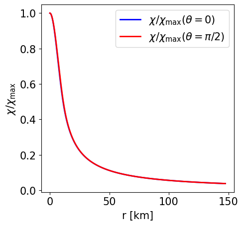 |
|:--:|
| *Radial profile of the scalar field at the pole and at the equator.* |

|  |
|:--:|
| *Radial profile of the lapse function at the pole and at the equator.* |

|  |
|:--:|
| *Radial profile of the conformal factor at the pole and at the equator.* |

| 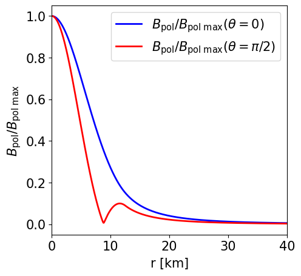 |
|:--:|
| *Radial profile of the poloidal magnetic field strength at the pole and at the equator.* |

## Rotating, unmagnetised NS in GR with the ??? EoS

Description.

Here are the main parameters used to compute this model. The detailed log with all the parameters can be found in the corresponding LogFile.dat.

```
PARAM1 = VALUE1, PARAM2 = VALUE2, PARAM3 = VALUE3, PARAM4 = VALUE4, ...
```

## Rotating, magnetised NS in GR with the ??? EoS

Description.

Here are the main parameters used to compute this model. The detailed log with all the parameters can be found in the corresponding LogFile.dat.

```
PARAM1 = VALUE1, PARAM2 = VALUE2, PARAM3 = VALUE3, PARAM4 = VALUE4, ...
```
