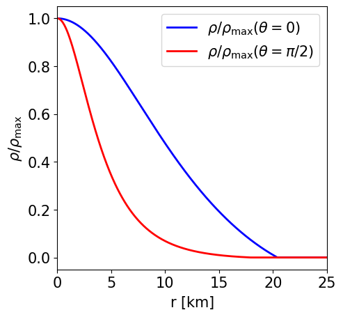

# Examples in GR

Here we present a few examples to show how to work with the code and the related performances. All
cases have been run on a simple laptop

## Non-rotating NS in GR with the POL2 EoS and a purely poloidal magnetic field

This is a model of an NS in GR described by the analytic POL2 EoS, endowed with a purely poloidal field. It has a J-frame central density $\rho _\mathrm{c}=8.3\times 10^{-4}$ in code units (corresponding to $5.15\times 10^{14}$ gcm$^{-3}$) and a Komar mass in the E-frame of $1.442$ M$ _\odot$. The circumferential radius is $16.559$ km.

Here are the main parameters used to compute this model. The detailed log with all the parameters can be found in the corresponding LogFile.dat.

```
NR = 900, NTH = 100, NRREG = 600, MLS = 20, NGQ = 50, RREG = 13, RMAXSTR = 100,
RMAX = 100, REQMAX = 13.50, RHOINI = 8.30E-4, ALPHA0 = -2.0E-4, BETA0 = -6, GR = .FALSE.,
STRETCH = .TRUE., ANALYTIC = .TRUE., CONVHELP = .FALSE., QFACTOR = 0.85, QFACTORCHI = 0.45,
QFACTORMETRIC = 0.35, QRELAX = 0.30, QAPHI = 0.50, EOSINT = .FALSE., K1 = 110.0, GAMMA = 2.0,
IMAG = .TRUE., IPOL = .TRUE., KBPOL = 0.34135, NPOL = 0.0, CSI = 0.0
```

|  |
|:--:|
| *Section of the NS in the $x-z$ plane along with the contours the density.* |

|  |
|:--:|
| *Section of the NS in the $x-z$ plane along with the contours the poloidal magnetic field strength and its field lines.* |

|  |
|:--:|
| *Radial profile of the NS density at the pole and at the equator.* |

|  |
|:--:|
| *Radial profile of the NS pressure at the pole and at the equator.* |

|  |
|:--:|
| *Radial profile of the lapse function at the pole and at the equator.* |

|  |
|:--:|
| *Radial profile of the conformal factor at the pole and at the equator.* |

|  |
|:--:|
| *Radial profile of the poloidal magnetic field strength at the pole and at the equator.* |

## Non-rotating NS in GR with the POL2 EoS and a purely toroidal magnetic field

This is a model of an NS in GR described by the analytic POL2 EoS, endowed with a purely toroidal field. It has a central density $\rho _\mathrm{c}=1.366\times 10^{-3}$ in code units (corresponding to $8.473\times 10^{14}$ gcm$^{-3}$) and a Komar mass of $1.597$ M$ _\odot$. The circumferential radius is $20.264$ km.

Here are the main parameters used to compute this model. The detailed log with all the parameters can be found in the corresponding LogFile.dat.

```
NR = 900, NTH = 100, NRREG = 600, MLS = 20, NGQ = 50, RREG = 13, RMAXSTR = 100,
RMAX = 100, REQMAX = 15.50, RHOINI = 1.366E-3, ALPHA0 = 0.0, BETA0 = 0.0, GR = .TRUE.,
STRETCH = .TRUE., ANALYTIC = .TRUE., CONVHELP = .FALSE., QFACTOR = 0.85, QFACTORCHI = 0.45,
QFACTORMETRIC = 0.35, QRELAX = 0.30, QAPHI = 0.50, EOSINT = .FALSE., K1 = 110.0, GAMMA = 2.0,
IMAG = .TRUE., ITOR = .TRUE., BCOEF = 3.746, NPOL = 0.0, CSI = 0.0
```

|  |
|:--:|
| *Section of the NS in the $x-z$ plane along with the contours the density.* |

|  |
|:--:|
| *Section of the NS in the $x-z$ plane along with the contours the toroidal magnetic field strength.* |

|  |
|:--:|
| *Radial profile of the NS density at the pole and at the equator.* |

|  |
|:--:|
| *Radial profile of the NS pressure at the pole and at the equator.* |

|  |
|:--:|
| *Radial profile of the lapse function at the pole and at the equator.* |

|  |
|:--:|
| *Radial profile of the conformal factor at the pole and at the equator.* |

|  |
|:--:|
| *Radial profile of the toroidal magnetic field strength at the pole and at the equator.*

## Non-rotating NS in GR with the POL2 EoS and a twisted magnetosphere

This is a model of an NS in GR described by the analytic POL2 EoS, endowed with a purely toroidal field. It has a central density $\rho _\mathrm{c}=1.366\times 10^{-3}$ in code units (corresponding to $8.473\times 10^{14}$ gcm$^{-3}$) and a Komar mass of $1.597$ M$ _\odot$. The circumferential radius is $20.264$ km.

Here are the main parameters used to compute this model. The detailed log with all the parameters can be found in the corresponding LogFile.dat.

```
NR = 900, NTH = 100, NRREG = 600, MLS = 20, NGQ = 50, RREG = 13, RMAXSTR = 100,
RMAX = 100, REQMAX = 15.50, RHOINI = 1.366E-3, ALPHA0 = 0.0, BETA0 = 0.0, GR = .TRUE.,
STRETCH = .TRUE., ANALYTIC = .TRUE., CONVHELP = .FALSE., QFACTOR = 0.85, QFACTORCHI = 0.45,
QFACTORMETRIC = 0.35, QRELAX = 0.30, QAPHI = 0.50, EOSINT = .FALSE., K1 = 110.0, GAMMA = 2.0,
IMAG = .TRUE., ITOR = .TRUE., BCOEF = 3.746, NPOL = 0.0, CSI = 0.0
```


## Uniformly Rotating, unmagnetised NS in GR with the Pol2 EoS

Description.

Here are the main parameters used to compute this model. The detailed log with all the parameters can be found in the corresponding LogFile.dat.

```
PARAM1 = VALUE1, PARAM2 = VALUE2, PARAM3 = VALUE3, PARAM4 = VALUE4, ...
```

## Differnetially Rotating, unmagnetised NS in GR with the APR EoS

```
PARAM1 = VALUE1, PARAM2 = VALUE2, PARAM3 = VALUE3, PARAM4 = VALUE4, ...
```

## Differentially Rotating, toroidal magnetised NS in GR with the Pol2 EoS

Description.

Here are the main parameters used to compute this model. The detailed log with all the parameters can be found in the corresponding LogFile.dat.

```
PARAM1 = VALUE1, PARAM2 = VALUE2, PARAM3 = VALUE3, PARAM4 = VALUE4, ...
```

## Uniformly Rotating, poloidal magnetised NS in GR with the Pol2 EoS

Description.

Here are the main parameters used to compute this model. The detailed log with all the parameters can be found in the corresponding LogFile.dat.

```
PARAM1 = VALUE1, PARAM2 = VALUE2, PARAM3 = VALUE3, PARAM4 = VALUE4, ...
```

