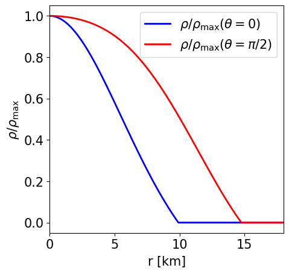
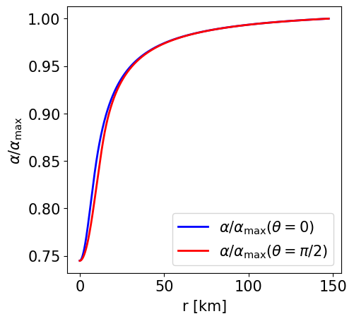
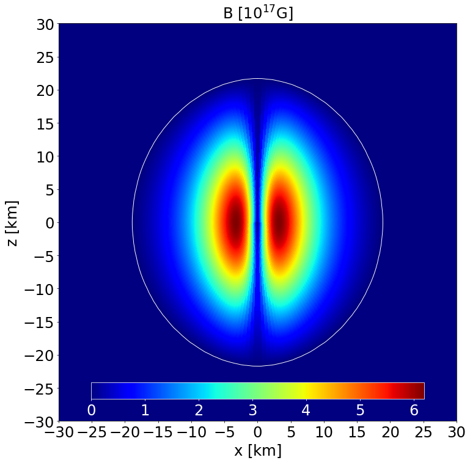

# Examples in STTs

Here we present a few examples to show how to work with the code and the related performances. All
cases have been run on a laptop.  If you wish to run one of them, just copy the **SYSTEMXNS.f90** file from the related subfolder, in the *documentantion/examples* directory.

## Non-rotating, unmagnetised NS in STT with the APR EoS

This is a model of an unmagnetised NS in STTs with $\alpha _0 = -2.0\times 10^{-4}$ and $\beta _0 = -6$ described by the APR EoS. It has a J-frame central density $\rho _\mathrm{c}=1.4\times 10^{-3}$ in code units (corresponding to $8.684\times 10^{14}$ gcm$^{-3}$) and a Komar mass in the E-frame of $1.086$ M$ _\odot$. The circumferential radius in the J-frame is $10.963$ km, and the E-frame scalar charge is $0.532$ M$ _\odot$.

Here are the main parameters used to compute this model. The detailed log with all the parameters can be found in the corresponding LogFile.dat.

```
NR = 900, NTH = 100, NRREG = 600, MLS = 20, NGQ = 50, RREG = 10, RMAXSTR = 100,
RMAX = 100, REQMAX = 11.50, RHOINI = 1.40E-3, ALPHA0 = -2.0E-4, BETA0 = -6, GR = .FALSE.,
STRETCH = .TRUE., ANALYTIC = .TRUE., CONVHELP = .FALSE., QFACTOR = 0.85, QFACTORCHI = 0.45,
QFACTORMETRIC = 0.35, QRELAX = 0.30, QAPHI = 0.50, EOSINT = .TRUE., FILEEOS = 'APR_resampled.dat'
```

|  |
|:--:|
| *Section of the NS in the $x-z$ plane along with the contours the density.* |

|  |
|:--:|
| *Section of the NS in the $x-z$ plane along with the contours the scalar field.* |

|  |
|:--:|
| *Radial profile of the NS density at the pole and at the equator.* |

|  |
|:--:|
| *Radial profile of the NS pressure at the pole and at the equator.* |

|  |
|:--:|
| *Radial profile of the scalar field at the pole and at the equator.* |

|  |
|:--:|
| *Radial profile of the lapse function at the pole and at the equator.* |

|  |
|:--:|
| *Radial profile of the conformal factor at the pole and at the equator.* |

## Non-rotating NS in STT with the APR EoS and a purely poloidal magnetic field

This is a model of an NS in STTs with $\alpha _0 = -2.0\times 10^{-4}$ and $\beta _0 = -6$ described by the APR EoS, endowed with a purely poloidal field. It has a J-frame central density $\rho _\mathrm{c}=1.4\times 10^{-3}$ in code units (corresponding to $8.684\times 10^{14}$ gcm$^{-3}$) and a Komar mass in the E-frame of $1.098$ M$ _\odot$. The circumferential radius in the J-frame is $11.072$ km, and the E-frame scalar charge is $0.551$ M$ _\odot$.

Here are the main parameters used to compute this model. The detailed log with all the parameters can be found in the corresponding LogFile.dat.

```
NR = 900, NTH = 100, NRREG = 600, MLS = 20, NGQ = 50, RREG = 10, RMAXSTR = 100,
RMAX = 100, REQMAX = 11.50, RHOINI = 1.40E-3, ALPHA0 = -2.0E-4, BETA0 = -6, GR = .FALSE.,
STRETCH = .TRUE., ANALYTIC = .TRUE., CONVHELP = .FALSE., QFACTOR = 0.85, QFACTORCHI = 0.45,
QFACTORMETRIC = 0.35, QRELAX = 0.30, QAPHI = 0.50, EOSINT = .TRUE., FILEEOS = 'APR_resampled.dat',
IMAG = .TRUE., IPOL = .TRUE., KBPOL = 0.2, NPOL = 0.0, CSI = 0.0
```

|  |
|:--:|
| *Section of the NS in the $x-z$ plane along with the contours the density.* |

|  |
|:--:|
| *Section of the NS in the $x-z$ plane along with the contours the scalar field.* |

|  |
|:--:|
| *Section of the NS in the $x-z$ plane along with the contours the poloidal magnetic field strength and its field lines.* |

|  |
|:--:|
| *Radial profile of the NS density at the pole and at the equator.* |

|  |
|:--:|
| *Radial profile of the NS pressure at the pole and at the equator.* |

|  |
|:--:|
| *Radial profile of the scalar field at the pole and at the equator.* |

|  |
|:--:|
| *Radial profile of the lapse function at the pole and at the equator.* |

|  |
|:--:|
| *Radial profile of the conformal factor at the pole and at the equator.* |

|  |
|:--:|
| *Radial profile of the poloidal magnetic field strength at the pole and at the equator.* |

## Non-rotating NS in STT with the APR EoS and a purely toroidal magnetic field

This is a model of an NS in STTs with $\alpha _0 = -2.0\times 10^{-4}$ and $\beta _0 = -6$ described by the APR EoS, endowed with a purely toroidal field. It has a J-frame central density $\rho _\mathrm{c}=1.4\times 10^{-3}$ in code units (corresponding to $8.684\times 10^{14}$ gcm$^{-3}$) and a Komar mass in the E-frame of $1.078$ M$ _\odot$. The circumferential radius in the J-frame is $11.060$ km, and the E-frame scalar charge is $0.515$ M$ _\odot$.

Here are the main parameters used to compute this model. The detailed log with all the parameters can be found in the corresponding LogFile.dat.

```
NR = 900, NTH = 100, NRREG = 600, MLS = 20, NGQ = 50, RREG = 10, RMAXSTR = 100,
RMAX = 100, REQMAX = 11.50, RHOINI = 1.40E-3, ALPHA0 = -2.0E-4, BETA0 = -6, GR = .FALSE.,
STRETCH = .TRUE., ANALYTIC = .TRUE., CONVHELP = .FALSE., QFACTOR = 0.85, QFACTORCHI = 0.45,
QFACTORMETRIC = 0.35, QRELAX = 0.30, QAPHI = 0.50, EOSINT = .TRUE., FILEEOS = 'APR_resampled.dat',
IMAG = .TRUE., ITOR = .TRUE., BCOEF = 0.7, NPOL = 0.0, CSI = 0.0
```

|  |
|:--:|
| *Section of the NS in the $x-z$ plane along with the contours the density.* |

|  |
|:--:|
| *Section of the NS in the $x-z$ plane along with the contours the scalar field.* |

|  |
|:--:|
| *Section of the NS in the $x-z$ plane along with the contours the toroidal magnetic field strength.* |

|  |
|:--:|
| *Radial profile of the NS density at the pole and at the equator.* |

|  |
|:--:|
| *Radial profile of the NS pressure at the pole and at the equator.* |

|  |
|:--:|
| *Radial profile of the scalar field at the pole and at the equator.* |

|  |
|:--:|
| *Radial profile of the lapse function at the pole and at the equator.* |

|  |
|:--:|
| *Radial profile of the conformal factor at the pole and at the equator.* |

|  |
|:--:|
| *Radial profile of the toroidal magnetic field strength at the pole and at the equator.* |

## Non-rotating, unmagnetised NS in STT with the POL2 EoS

This is a model of an unmagnetised NS in STTs with $\alpha _0 = -2.0\times 10^{-4}$ and $\beta _0 = -6$ described by the analytic POL2 EoS. It has a J-frame central density $\rho _\mathrm{c}=1.36\times 10^{-3}$ in code units (corresponding to $8.44\times 10^{14}$ gcm$^{-3}$) and a Komar mass in the E-frame of $1.296$ M$ _\odot$. The circumferential radius in the J-frame is $14.156$ km, and the E-frame scalar charge is $0.645$ M$ _\odot$.

Here are the main parameters used to compute this model. The detailed log with all the parameters can be found in the corresponding LogFile.dat.

```
NR = 900, NTH = 100, NRREG = 600, MLS = 20, NGQ = 50, RREG = 10, RMAXSTR = 100,
RMAX = 100, REQMAX = 15.0, RHOINI = 1.36E-3, ALPHA0 = -2.0E-4, BETA0 = -6, GR = .FALSE.,
STRETCH = .TRUE., ANALYTIC = .TRUE., CONVHELP = .FALSE., QFACTOR = 0.85, QFACTORCHI = 0.45,
QFACTORMETRIC = 0.35, QRELAX = 0.30, QAPHI = 0.50, EOSINT = .FALSE., K1 = 110.0, GAMMA = 2.0
```

|  |
|:--:|
| *Section of the NS in the $x-z$ plane along with the contours the density.* |

|  |
|:--:|
| *Section of the NS in the $x-z$ plane along with the contours the scalar field.* |

|  |
|:--:|
| *Radial profile of the NS density at the pole and at the equator.* |

|  |
|:--:|
| *Radial profile of the NS pressure at the pole and at the equator.* |

|  |
|:--:|
| *Radial profile of the scalar field at the pole and at the equator.* |

|  |
|:--:|
| *Radial profile of the lapse function at the pole and at the equator.* |

|  |
|:--:|
| *Radial profile of the conformal factor at the pole and at the equator.* |

## Non-rotating NS in STT with the POL2 EoS and a purely poloidal magnetic field

This is a model of an NS in STTs with $\alpha _0 = -2.0\times 10^{-4}$ and $\beta _0 = -6$ described by the analytic POL2 EoS, endowed with a purely poloidal field. It has a J-frame central density $\rho _\mathrm{c}=8.30\times 10^{-4}$ in code units (corresponding to $5.15\times 10^{14}$ gcm$^{-3}$) and a Komar mass in the E-frame of $1.356$ M$ _\odot$. The circumferential radius in the J-frame is $16.718$ km, and the E-frame scalar charge is $0.564$ M$ _\odot$.

Here are the main parameters used to compute this model. The detailed log with all the parameters can be found in the corresponding LogFile.dat.

```
NR = 900, NTH = 100, NRREG = 600, MLS = 20, NGQ = 50, RREG = 20, RMAXSTR = 100,
RMAX = 100, REQMAX = 25.0, RHOINI = 8.30E-4, ALPHA0 = -2.0E-4, BETA0 = -6, GR = .FALSE.,
STRETCH = .TRUE., ANALYTIC = .TRUE., CONVHELP = .FALSE., QFACTOR = 0.85, QFACTORCHI = 0.45,
QFACTORMETRIC = 0.35, QRELAX = 0.30, QAPHI = 0.50, EOSINT = .FALSE., K1 = 110.0, GAMMA = 2.0,
IMAG = .TRUE., IPOL = .TRUE., KBPOL = 0.44, NPOL = 0.0, CSI = 0.0
```

|  |
|:--:|
| *Section of the NS in the $x-z$ plane along with the contours the density.* |

|  |
|:--:|
| *Section of the NS in the $x-z$ plane along with the contours the scalar field.* |

|  |
|:--:|
| *Section of the NS in the $x-z$ plane along with the contours the poloidal magnetic field strength and its field lines.* |

|  |
|:--:|
| *Radial profile of the NS density at the pole and at the equator.* |

|  |
|:--:|
| *Radial profile of the NS pressure at the pole and at the equator.* |

|  |
|:--:|
| *Radial profile of the scalar field at the pole and at the equator.* |

|  |
|:--:|
| *Radial profile of the lapse function at the pole and at the equator.* |

|  |
|:--:|
| *Radial profile of the conformal factor at the pole and at the equator.* |

|  |
|:--:|
| *Radial profile of the poloidal magnetic field strength at the pole and at the equator.* |

## Non-rotating NS in STT with the POL2 EoS and a purely toroidal magnetic field

This is a model of an NS in STTs with $\alpha _0 = -2.0\times 10^{-4}$ and $\beta _0 = -6$ described by the analytic POL2 EoS, endowed with a purely toroidal field. It has a J-frame central density $\rho _\mathrm{c}=1.36\times 10^{-3}$ in code units (corresponding to $8.44\times 10^{14}$ gcm$^{-3}$) and a Komar mass in the E-frame of $1.467$ M$ _\odot$. The circumferential radius in the J-frame is $20.916$ km, and the E-frame scalar charge is $0.473$ M$ _\odot$.

Here are the main parameters used to compute this model. The detailed log with all the parameters can be found in the corresponding LogFile.dat.

```
NR = 900, NTH = 100, NRREG = 600, MLS = 20, NGQ = 50, RREG = 20, RMAXSTR = 100,
RMAX = 100, REQMAX = 25.0, RHOINI = 1.36E-3, ALPHA0 = -2.0E-4, BETA0 = -6, GR = .FALSE.,
STRETCH = .TRUE., ANALYTIC = .TRUE., CONVHELP = .FALSE., QFACTOR = 0.85, QFACTORCHI = 0.45,
QFACTORMETRIC = 0.35, QRELAX = 0.30, QAPHI = 0.50, EOSINT = .FALSE., K1 = 110.0, GAMMA = 2.0,
IMAG = .TRUE., ITOR = .TRUE., BCOEF = 4.0, NPOL = 0.0, CSI = 0.0
```

|  |
|:--:|
| *Section of the NS in the $x-z$ plane along with the contours the density.* |

|  |
|:--:|
| *Section of the NS in the $x-z$ plane along with the contours the scalar field.* |

|  |
|:--:|
| *Section of the NS in the $x-z$ plane along with the contours the toroidal magnetic field strength.* |

|  |
|:--:|
| *Radial profile of the NS density at the pole and at the equator.* |

|  |
|:--:|
| *Radial profile of the NS pressure at the pole and at the equator.* |

|  |
|:--:|
| *Radial profile of the scalar field at the pole and at the equator.* |

|  |
|:--:|
| *Radial profile of the lapse function at the pole and at the equator.* |

|  |
|:--:|
| *Radial profile of the conformal factor at the pole and at the equator.* |

|  |
|:--:|
| *Radial profile of the toroidal magnetic field strength at the pole and at the equator.* |
